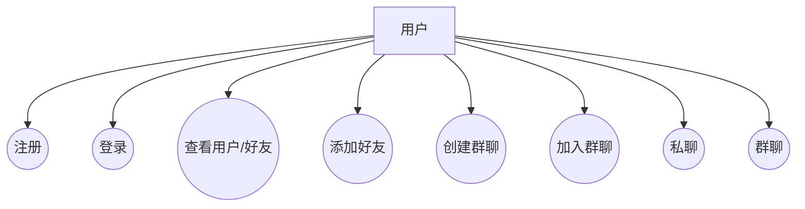

## 项目名称

WebChat 实时聊天系统

## 系统功能框图

下图展示了前端、后端、长连接与数据层之间的主要模块与交互关系。

```mermaid
flowchart LR
    subgraph Frontend[前端 (Vue 3 + Vite)]
      UI[登录/注册界面]
      ChatUI[聊天界面]
      State[Pinia 用户状态]
    end

    subgraph Backend[后端 (Spring Boot)]
      Auth[AuthController / UsersController]
      Friend[FriendGroupController]
      MsgAPI[MessageController]
      Socket[Socket.IO 事件处理\nChatSocketHandler]
      Service[Service 层\n(User/Group/MessageService)]
      Repo[JPA Repository 层\n(User/Group/Message/Friendship)]
    end

    DB[(SQLite 数据库\n data/webchat.db)]

    UI -->|REST /auth,/users| Auth
    UI -->|REST /friend,/group| Friend
    ChatUI -->|REST /messages| MsgAPI
    ChatUI <--> |Socket.IO| Socket

    Auth --> Service
    Friend --> Service
    MsgAPI --> Service
    Socket --> Service
    Service --> Repo
    Repo --> DB
```

简要说明：

- 前端使用 Vue 3 + Vite，页面包含登录/注册与聊天界面，使用 Pinia 管理用户状态。
- 后端为 Spring Boot，暴露认证、用户、好友/群组与消息 REST 接口，并通过 Socket.IO 处理实时聊天事件。
- 数据层采用 JPA 访问 SQLite 本地数据库，存储用户、好友关系、群聊、消息等信息。

## 系统用例图

下图从用户视角概括系统支持的核心用例。



简要说明：

- 用户可注册、登录，查看用户列表/好友列表。
- 用户可添加好友、创建或加入群聊。
- 用户可进行私聊与群聊，消息经由 REST 获取历史、Socket.IO 实时分发。
